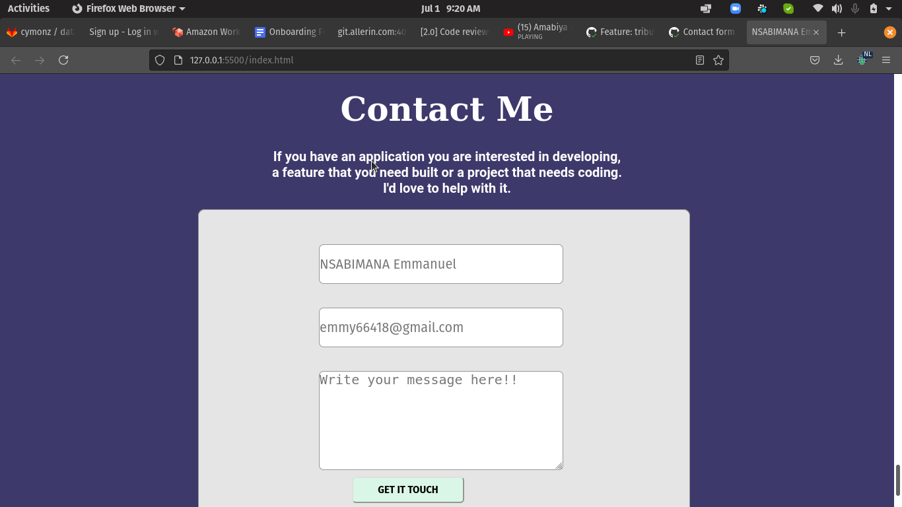

# Microverse - Contact-form

This is a Contact form Microverse project that shows how to do the following features.

    Name field accepts up to 30 chars.
    Email field accepts only emails.
    Message field accepts up to 500 chars.
    All fields have placeholder text.
    All fields have the correct type.
    A user cannot submit the form if one or more of the fields is empty.

# Built With

- HTML and CSS
- Forms
Introducing Linters
- Sytle Lint
- WebHint
- Lighthouse

👤 Author:

👤NSABIMANA Emmanuel
- GitHub: [@emmyn5600](https://github.com/Emmyn5600)
- Twitter: [@NSABIMA62253884](https://twitter.com/NSABIMA62253884)
- LinkedIn: [@nsabimana-emmanuel-4276091b2](https://www.linkedin.com/in/nsabimana-emmanuel-4276091b2/)

# 🤝Contributing

Contributions, issues, and feature requests are welcome!

Feel free to check the issues page. Show your support

Give a ⭐️ if you like this project!

# Acknowledgments

- Hat tip to anyone whose code was used
- Inspiration
- etc

# 📝 License 
This project is MIT licensed.